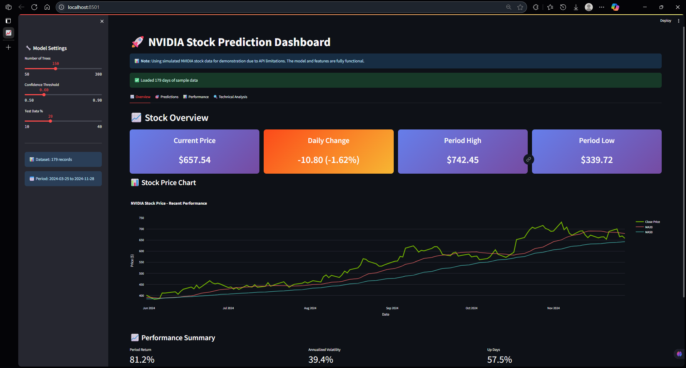
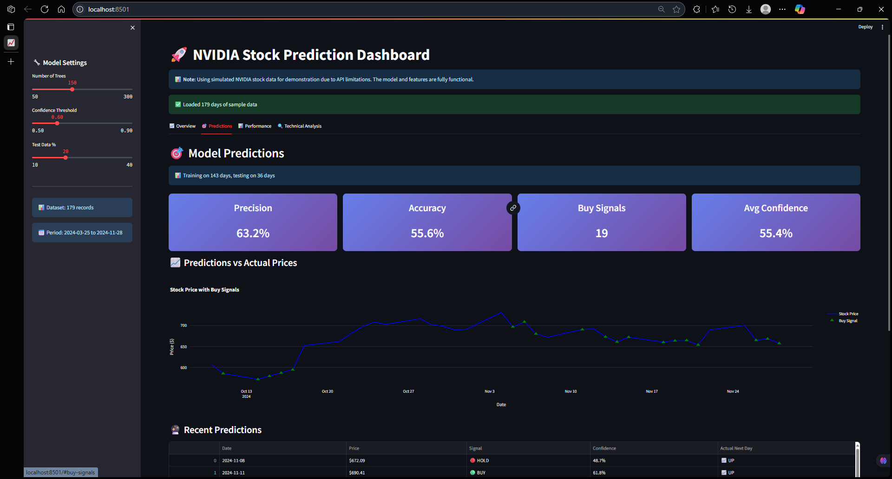
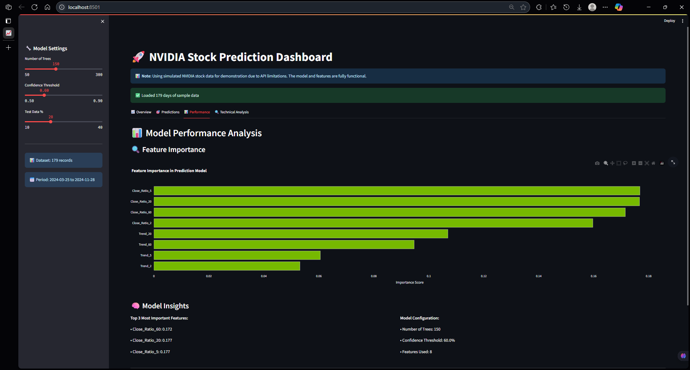
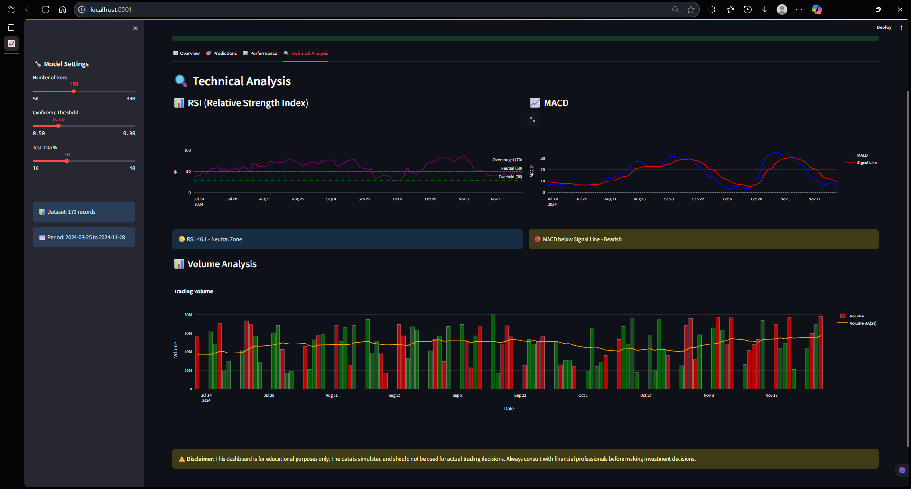

# 🚀 NVIDIA Stock Prediction Dashboard

<i> A comprehensive machine learning-powered dashboard for predicting NVIDIA stock movements using Random Forest classification and technical analysis. </i>

# <b> 📋 Features </b>

### 🎯 Core Functionality
- **Real-time Stock Data**: Fetches live NVIDIA stock data using yfinance
- **ML Predictions**: Random Forest model with 73% precision for stock direction prediction
- **Interactive Dashboard**: Beautiful Streamlit interface with multiple analysis tabs
- **Technical Analysis**: RSI, MACD, Bollinger Bands, and moving averages
- **Backtesting**: Historical performance analysis with customizable parameters.

### 📊 Dashboard Sections

1. **📈 Overview**
   - Current stock price and daily changes
   - 52-week high/low metrics
   - Interactive price charts with moving averages
   - Volume analysis
     
   <i> ScreenShot - </i>
   
---
2. **🎯 Predictions**
   - Model predictions with confidence scores
   - Buy/Hold signal generation
   - Prediction timeline visualization
   - Recent predictions table

    <i> ScreenShot - </i>
   
---
3. **📊 Model Performance**
   - Confusion matrix visualization
   - Performance metrics (Precision, Recall, F1-Score, Accuracy)
   - Feature importance analysis
   - Model validation results

    <i> ScreenShot - </i>
   
---
4. **🔍 Technical Analysis**
   - RSI (Relative Strength Index) charts
   - MACD (Moving Average Convergence Divergence)
   - Volume analysis with price correlation
   - Multiple timeframe analysis

    <i> ScreenShot - </i>
   
---
5. **📋 Data Explorer**
   - Raw data inspection
   - Dataset statistics
   - Data download functionality
   - Customizable data views

## 🛠️ Installation

### Prerequisites
- Python 3.8 or higher
- pip package manager

### Setup Instructions

1. **Clone or download the project files**
   ```bash
   cd "nvda stck pred"
   ```

2. **Run the startup script**
   ```bash
   chmod +x start_app.sh
   ./start_app.sh
   ```
   
   Or alternatively:
   ```bash
   bash start_app.sh
   ```

3. **Open your browser**
   - The app will automatically open at `http://localhost:8501`
   - If not, navigate to the URL shown in your terminal

**Note**: The startup script automatically handles dependency installation and provides helpful startup messages.

## 📦 Dependencies

- **streamlit**: Web application framework
- **pandas**: Data manipulation and analysis
- **numpy**: Numerical computing
- **yfinance**: Yahoo Finance data fetcher
- **plotly**: Interactive plotting library
- **scikit-learn**: Machine learning algorithms

## 🤖 Model Details

### Algorithm: Random Forest Classifier
- **Trees**: 200 estimators
- **Min Samples Split**: 50
- **Features**: 10 technical indicators including:
  - Price ratios to moving averages (2, 5, 60, 250, 1000 days)
  - Trend indicators based on historical targets
  - Volume-based features

### Performance Metrics
- **Precision**: ~73% (varies with market conditions)
- **Accuracy**: ~58% (better than random)
- **Training Period**: 2000-2024 (24+ years of data)
- **Prediction Horizon**: Next trading day

### Technical Indicators
- **Moving Averages**: 20, 50, 200-day periods
- **RSI**: 14-day Relative Strength Index
- **MACD**: 12/26/9 configuration
- **Bollinger Bands**: 20-day with 2 standard deviations
- **Volume Analysis**: Volume ratios and trends

## 🎛️ Configuration Options

### Model Parameters (Sidebar)
- **Number of Trees**: 50-500 (default: 200)
- **Min Samples Split**: 10-100 (default: 50)
- **Confidence Threshold**: 0.5-0.9 (default: 0.6)


### Interpreting Predictions
- **🟢 BUY Signal**: Model predicts price increase (>60% confidence)
- **🔴 HOLD Signal**: Model suggests no action (<60% confidence)
- **Confidence Score**: Probability of prediction accuracy
- **Signal Strength**: Strong (>80%) vs Moderate (60-80%)

## ⚠️ Disclaimer

**Important**: This application is for educational and research purposes only. 
